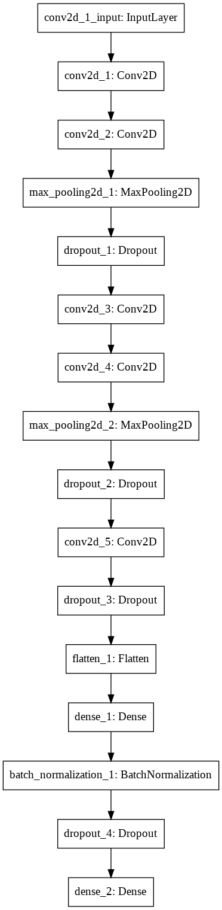

# 課題１ 手書き数字（MNIST）分類問題

データセット作成
----
`prepare_data()`という関数でkeras.datasets.mnistからmnistのnumpy assay化されたデータをダウンロードし、入力の配列を一律に1/255をかけることで正規化している。また、正解ラベルはkeras.utils.to_categorical()を使ってOne-Hotベクトルに変換している。

モデル構築
----
　以下のような畳み込みニューラルネットワークをAdamで訓練した。

テスト結果
----
recall on test data:0.9931874632994621   
precision on test data:0.9932081572306484    
f1_score on test data:0.9931802056487191

コード実行手順
----
`python train.py`で訓練し、

`python eval.py`で評価できる。
