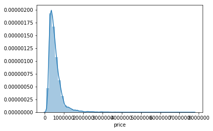
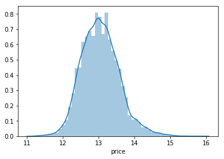
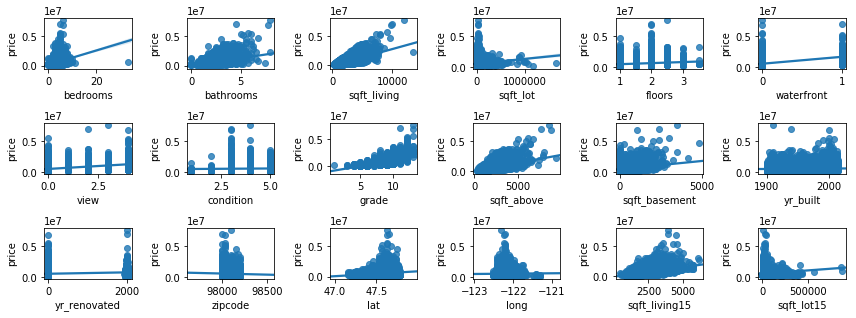
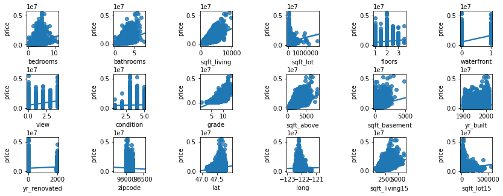
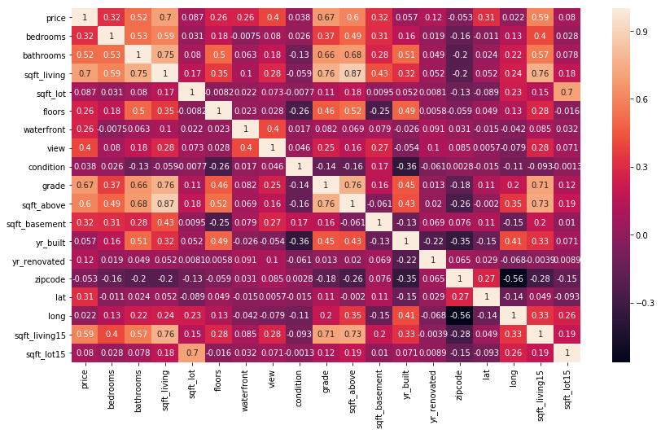

# 課題２ 物件価格予測回帰問題

データセット作成
----
`prepare_data()`という関数でデータをロードする。

目的変数である`price`は以下の図のように左に偏った分布だった。

そこで、`np.log()`によって対数に変換し、分布を正規分布に近づけた。

`price`以外の特徴を入力として用いた。特に欠損値はなかったので欠損値の補完は行わなかった。

データの散布図行列を以下に図示する。

学習には、これから外れ値と思われるものを除去したものを用いた。外れ値を除いた散布図行列は以下である。

データのヒートマップを図示すると以下になる。

なお、入力する特徴は`sklearn.preprocessing.StandardScalar`で標準化している。

モデル構築
----
モデルにはランダムフォレスト回帰とサポートベクター回帰を用い、スタッキングによって両者の出力の重み付き和を最終的な出力とした。
スタッキングの重み推定は`optuna`というベイズ最適化ツールを用いた。

テスト結果
----
テストデータに対する各評価は次のようになった。    
Mean Absolute Error: 0.12654377037650216
Mean Squared Error: 0.03262914465311867
R^2 Score: 0.8864508463607716

コード実行手順
----
https://colab.research.google.com/drive/1EZBrzxzPsSRmPPxLyIH7rqgVjaYUljKT

上記のGoogle Colaboratoryがソースコードとなっている。
